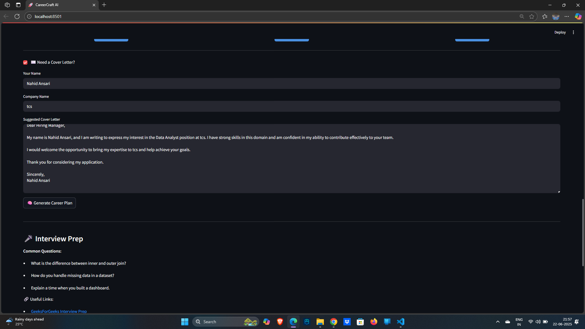
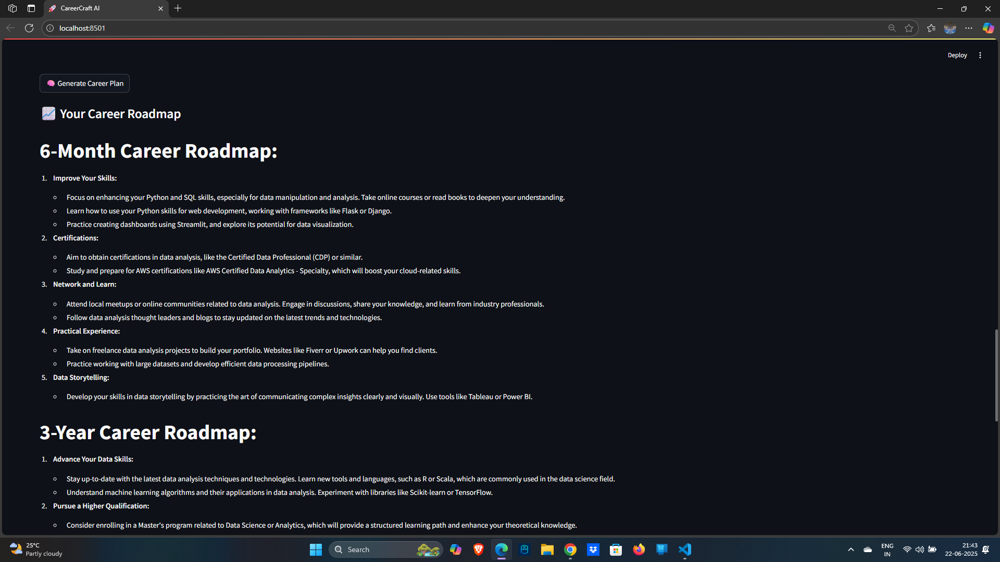
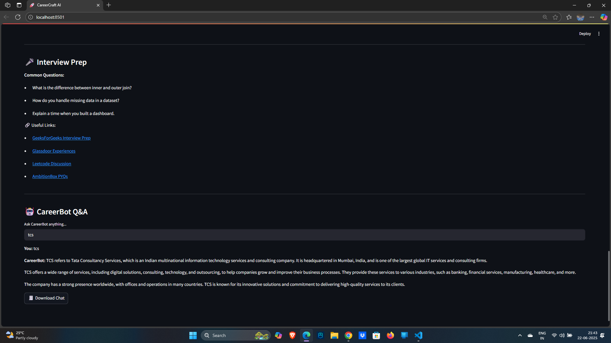

# 🚀 CareerCraft AI - Smart Career Recommendation Engine

[](https://streamlit.io/)
[](https://www.python.org/)
[](https://openai.com/)
[](https://opensource.org/licenses/MIT)

**Your Intelligent Career Companion for the Indian Job Market**

CareerCraft AI is a comprehensive, AI-powered career recommendation engine specifically designed for the Indian job market. It provides personalized job matching, skill development recommendations, and career planning tools with salary insights in LPA (Lakhs Per Annum) format.

## 🎯 Key Features

### 📄 **Smart Resume Analysis**
- **AI-powered resume parsing** with skill extraction
- **ATS compatibility scoring** and improvement suggestions
- **Professional resume templates** for different industries
- **Real-time feedback** on resume quality

### 💼 **Personalized Job Matching**
- **Intelligent job recommendations** based on skills and experience
- **Salary insights in LPA format** (₹X.X - Y.Y LPA)
- **Location-based filtering** (Remote, Mumbai, Bangalore, etc.)
- **Skill-based matching** with percentage compatibility

### 🎯 **Skill Development**
- **Interactive skill gap analysis** with professional visualizations
- **Personalized course recommendations** with progress tracking
- **Skill categorization** (Technical, Soft Skills, Domain-specific)
- **Learning roadmap generation** for career advancement

### 📈 **Advanced Analytics**
- **Skills radar charts** with interactive visualizations
- **Career timeline projections** with salary growth
- **Personalized learning plans** with Gantt charts
- **Skill assessments** with interactive quizzes
- **Interview preparation** with mock questions
- **Certification roadmaps** for career growth

### 🚀 **AI-Powered Features**
- **Cover letter generation** tailored to specific job roles
- **Interview preparation** with common questions and answers
- **ATS score optimization** for better job application success
- **AI chatbot assistant** for career guidance

## 🎨 **Professional UI Features**

- **Enterprise-grade design** with modern, responsive interface
- **Professional color scheme** with proper contrast and accessibility
- **Interactive elements** with smooth animations and hover effects
- **Clean typography** using Inter font family
- **Mobile-responsive** design for all devices
- **Glassmorphism effects** and advanced animations

## 🖼️ **Application Screenshots**

<div align="center">
  
  
</div>

<div align="center">
  
  
</div>

<div align="center">
  
  
</div>

<div align="center">
  
</div>

## 🚀 **Quick Start**

### 🌐 **Live Demo**
**[Try CareerCraft AI Live](https://careercraft-ai.streamlit.app/)**

### �️ **Local Installation**

1. **Clone the repository**
```bash
git clone https://github.com/Nahid305/smart-career-recommendation-engine.git
cd smart-career-recommendation-engine
```

2. **Install dependencies**
```bash
pip install -r requirements.txt
```

3. **Run the application**
```bash
streamlit run app.py
```

Visit `http://localhost:8501` to access the application.

### 🚀 **One-Click Deployment**

[](https://share.streamlit.io/deploy)


## 🔧 **Technical Stack**

### **Frontend**
- **Streamlit** - Web framework for Python
- **Custom CSS** - Advanced styling with animations
- **Plotly** - Interactive charts and visualizations
- **HTML/CSS** - Modern responsive design

### **Backend**
- **Python 3.10+** - Core programming language
- **Pandas** - Data manipulation and analysis
- **NumPy** - Numerical computing
- **Scikit-learn** - Machine learning algorithms

### **AI & Analytics**
- **Natural Language Processing** - Text analysis and extraction
- **Machine Learning** - Skill matching and recommendations
- **Data Visualization** - Interactive charts and graphs
- **Statistical Analysis** - Career insights and trends

## 📊 **Key Metrics**

- 🎯 **Skill Matching**: Advanced algorithms for precise job matching
- 📈 **Career Analytics**: Data-driven insights and visualizations
- 🚀 **Performance**: Fast loading and responsive design
- 📱 **Accessibility**: Mobile-friendly and user-centric interface
- 🔒 **Privacy**: Secure data handling and processing

## 🌟 **What Makes It Special**

### **For Job Seekers**
- ✅ **Personalized Recommendations**: AI-powered job matching
- ✅ **Skill Development**: Identify gaps and get learning suggestions
- ✅ **Resume Optimization**: ATS-friendly resume improvements
- ✅ **Interview Preparation**: Practice with AI-generated questions
- ✅ **Career Planning**: Visualize your career progression

### **For Employers**
- ✅ **Talent Pipeline**: Access to skilled candidates
- ✅ **Skill Assessment**: Evaluate candidate capabilities
- ✅ **Market Insights**: Understand talent trends
- ✅ **Efficient Matching**: Find the right candidates faster

## 🚀 **Streamlit Deployment**

### **Option 1: Streamlit Cloud (Recommended)**
1. Fork this repository
2. Go to [Streamlit Cloud](https://streamlit.io/cloud)
3. Click "New app" and connect your GitHub repository
4. Select `app.py` as the main file
5. Deploy automatically

### **Option 2: Docker Deployment**
```dockerfile
FROM python:3.10-slim

WORKDIR /app
COPY requirements.txt .
RUN pip install -r requirements.txt

COPY . .

EXPOSE 8501

CMD ["streamlit", "run", "app.py", "--server.port=8501", "--server.address=0.0.0.0"]
```

### **Option 3: Heroku Deployment**
1. Create `setup.sh`:
```bash
mkdir -p ~/.streamlit/
echo "[server]
headless = true
port = $PORT
enableCORS = false
" > ~/.streamlit/config.toml
```

2. Create `Procfile`:
```
web: sh setup.sh && streamlit run app.py
```

## 🔧 **Configuration**

### Environment Variables
Create a `.env` file in the root directory:
```env
OPENAI_API_KEY=your_openai_api_key_here
STREAMLIT_SERVER_PORT=8501
```

### Streamlit Configuration
The app includes custom configuration in `.streamlit/config.toml`:
```toml
[theme]
primaryColor = "#4f46e5"
backgroundColor = "#f8fafc"
secondaryBackgroundColor = "#ffffff"
textColor = "#1e293b"
font = "sans serif"
```

## 🤝 **Contributing**

We welcome contributions! Please follow these steps:

1. **Fork the repository**
2. **Create a feature branch**: `git checkout -b feature/amazing-feature`
3. **Commit your changes**: `git commit -m 'Add amazing feature'`
4. **Push to the branch**: `git push origin feature/amazing-feature`
5. **Open a Pull Request**

### Development Guidelines
- Follow PEP 8 style guidelines
- Write clear, documented code
- Test your changes thoroughly
- Update documentation as needed

## 🔮 **Future Enhancements**

- [ ] **Machine Learning Models**: Custom ML models for better job matching
- [ ] **LinkedIn Integration**: Import profile data directly
- [ ] **Video Interview Practice**: AI-powered mock interviews
- [ ] **Salary Negotiation Tool**: Data-driven negotiation insights
- [ ] **Company Reviews**: Integrate company culture insights
- [ ] **Mobile App**: React Native/Flutter mobile application

## 🆘 **Support**

Having issues? We're here to help!

- **🐛 Bug Reports**: [Open an issue](https://github.com/Nahid305/smart-career-recommendation-engine/issues)
- **💬 Discussions**: [GitHub Discussions](https://github.com/Nahid305/smart-career-recommendation-engine/discussions)
- **📧 Contact**: Feel free to reach out for support

## 📜 **License**

This project is licensed under the MIT License - see the [LICENSE](LICENSE) file for details.

## 🙏 **Acknowledgments**

- **Streamlit Team** for the amazing framework
- **Python Community** for excellent libraries
- **Open Source Contributors** for inspiration and support
- **Indian Job Market** for providing insights and data

---

<div align="center">
  <h3>Made with ❤️ for the Indian Job Market</h3>
  <p>CareerCraft AI - Empowering careers with intelligent insights</p>
  
  [](https://github.com/Nahid305)
  [](https://careercraft-ai.streamlit.app/)
  [](https://share.streamlit.io/deploy)
</div>