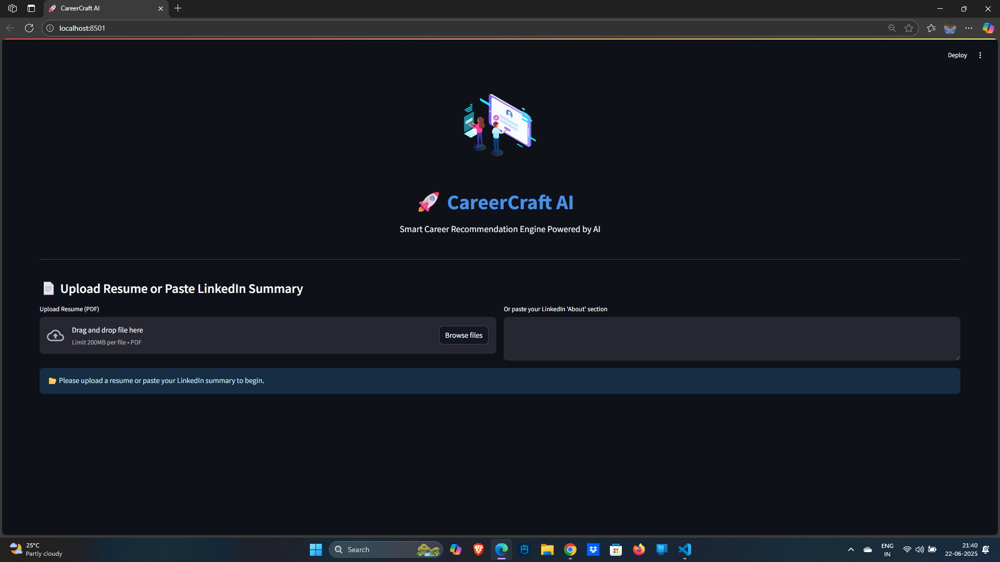
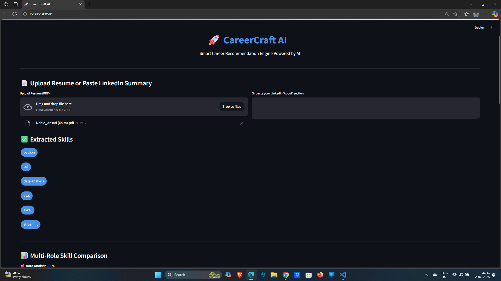
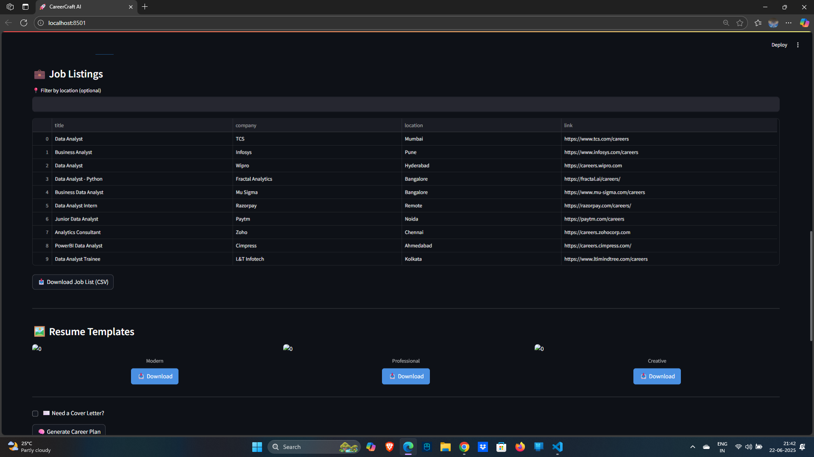
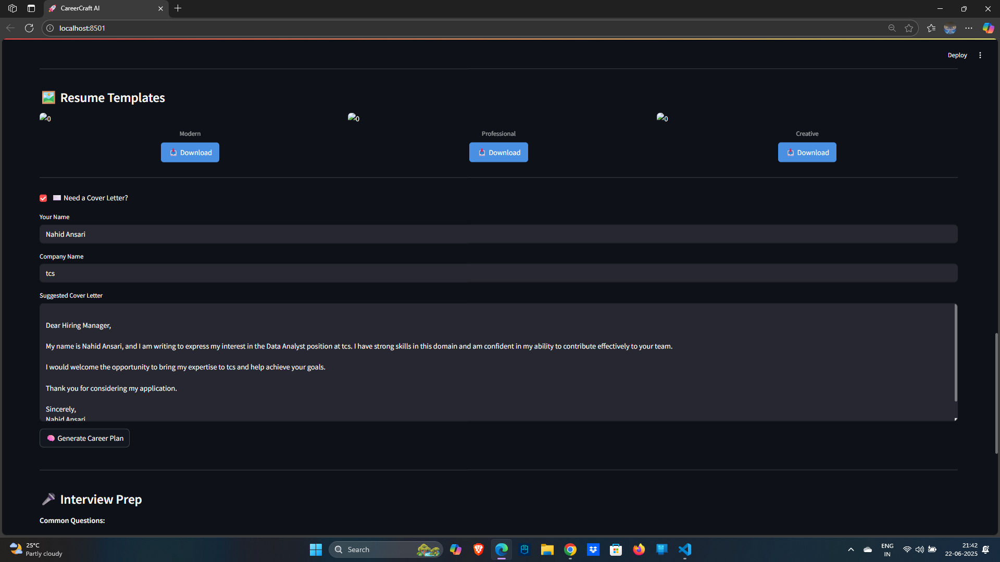
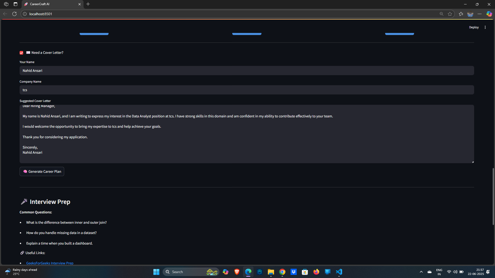
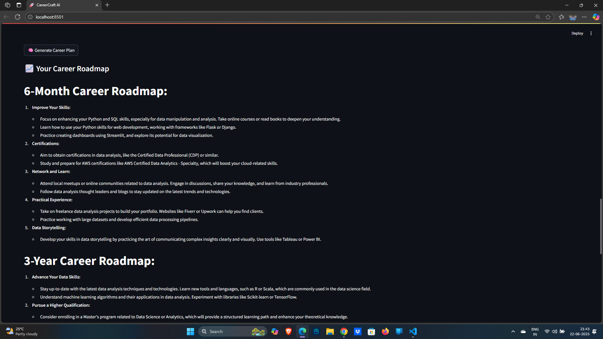
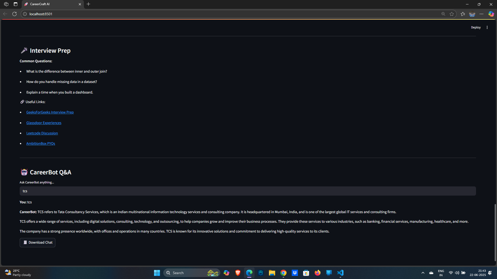

# 🚀 CareerCraft AI

🔗 **Live Demo**: [Click here to try CareerCraft AI](https://careerrecommendationengine.streamlit.app/)

CareerCraft AI is a smart career recommendation engine powered by AI. It helps you upload your resume or LinkedIn summary, analyze your skills, and suggest the most suitable job roles, missing skills, courses, job listings, resume templates, interview questions, and even a career growth plan — all in one app!


---

## 🔍 Features

- 📄 Upload Resume or Paste LinkedIn "About" section
- ✅ Extract Skills Automatically
- 📊 Compare Skill Match % for 3 Career Roles
- 📚 Get Recommended Courses for Missing Skills
- ⭐ Resume ATS Score + Suggestions
- 💼 Job Listings with Location Filter and Download
- 🖼️ Resume Templates with Preview & Download
- ✉️ Cover Letter Generator
- 🧠 AI Career Path Roadmap
- 🎤 Interview Questions & Resources
- 🤖 CareerBot Chat with Downloadable History

---

## 🛠️ Tech Stack

- Python (3.8+)
- Streamlit (Frontend)
- pdfplumber (Resume parsing)
- Cohere (for AI Q&A and planning)
- BeautifulSoup + Selenium (Job scraping)
- Matplotlib & Lottie (Charts + Animation)

---

## 🚀 How to Run

1. Clone the repo:
```bash
git clone https://github.com/YourUsername/careercraft-ai.git
cd careercraft-ai

2.Install dependencies:

  pip install -r requirements.txt

3.Add your Cohere API key in .streamlit/secrets.toml:
 
 [cohere]
 api_key = "your-cohere-api-key"

4.Run the app:
 
 streamlit run app.py

📦 Project Structure

career-craft-ai/
├ ── app.py
├── resume_parser.py
├── utils.py
├── skill_matcher.py
├── course_recommender.py
├── job_scraper.py
├── ats_checker.py
├── resume_templates.py
├── cover_letter_generator.py
├── interview_helper.py
├── career_chatbot.py
├── requirements.txt
├── README.md
└── .streamlit/
    └── secrets.toml

📬 Built With
 Streamlit
 Cohere
 LottieFiles
 BeautifulSoup

---

## 📸 App Screenshots

### 🏁 1. Landing Page


---

### 🧠 2. Skills Extracted + Match % Comparison


---

### 💼 3. Job Listings


---

### 📄 4. Resume Templates


---

### ✉️ 5. Cover Letter Generator


---

### 🚀 6. Career Roadmap (6 Months + 3 Years)


---

### 🤖 7. CareerBot Chat



🙌 Created By
Nahid Ansari – AI & Data Science Engineer 💼
Built with ❤️ to empower careers with AI.