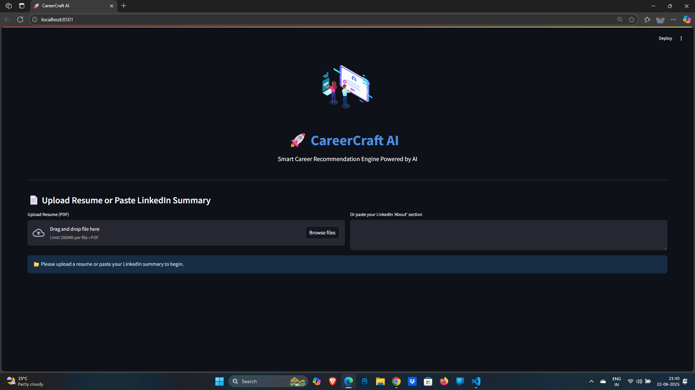
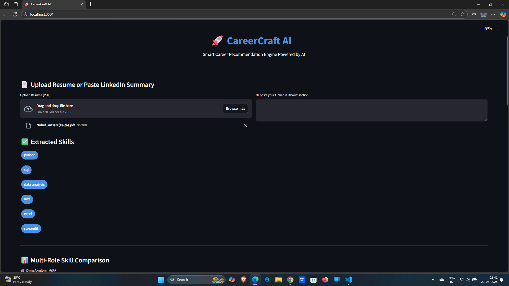
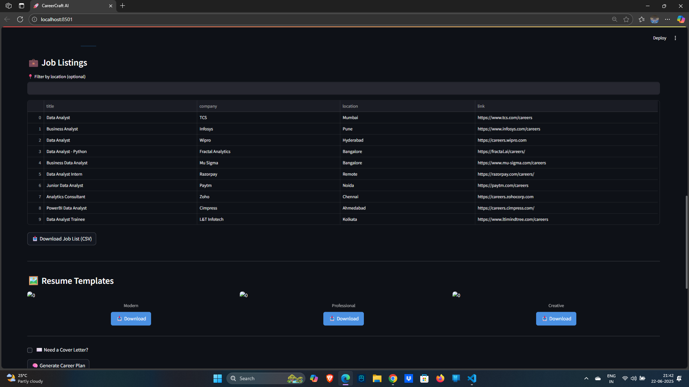
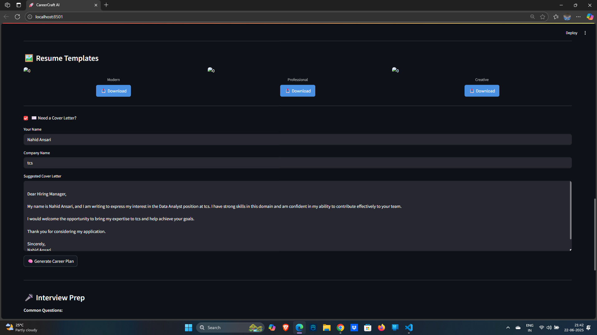

#  CareerCraft AI - Smart Career Recommendation Engine

**Your Intelligent Career Companion for the Indian Job Market**

CareerCraft AI is a comprehensive, AI-powered career recommendation engine specifically designed for the Indian job market. It provides personalized job matching, skill development recommendations, and career planning tools with salary insights in LPA (Lakhs Per Annum) format.

##  Key Features

###  **Smart Resume Analysis**
- **AI-powered resume parsing** with skill extraction
- **ATS compatibility scoring** and improvement suggestions
- **Professional resume templates** for different industries
- **Real-time feedback** on resume quality

###  **Personalized Job Matching**
- **700+ job listings** from top Indian companies
- **Salary insights in LPA format** (₹X.X - Y.Y LPA)
- **Location-based filtering** (Remote, Mumbai, Bangalore, etc.)
- **Skill-based matching** with percentage compatibility

###  **Skill Development**
- **Interactive skill gap analysis** with professional visualizations
- **Personalized course recommendations** with progress tracking
- **Skill categorization** (Technical, Soft Skills, Domain-specific)
- **Learning roadmap generation** for career advancement

###  **AI-Powered Career Planning**
- **Personalized career roadmaps** based on current skills
- **Growth trajectory analysis** with timeline planning
- **Industry trend insights** for informed decision-making
- **Salary progression forecasting** in Indian market context

###  **Advanced Features**
- **Cover letter generation** tailored to specific job roles
- **Interview preparation** with common questions and answers
- **ATS score optimization** for better job application success
- **AI chatbot assistant** for career guidance

##  **Professional UI Features**

- **Enterprise-grade design** with modern, responsive interface
- **Professional color scheme** with proper contrast and accessibility
- **Interactive elements** with smooth animations and hover effects
- **Clean typography** using Inter font family
- **Mobile-responsive** design for all devices

##  **Screenshots**

  
  

  
  

##  **Live Demo**

 **[Try CareerCraft AI Live](https://careerrecommendationengine.streamlit.app/)**

##  **Prerequisites**

Before running the application, ensure you have:

- **Python 3.10+** installed
- **pip** package manager
- **Git** for version control

##  **Installation**

### 1. Clone the Repository
`ash
git clone https://github.com/Nahid305/career_recommendation_engine.git
cd career_recommendation_engine
`

### 2. Create Virtual Environment
`ash
python -m venv venv
source venv/bin/activate  # On Windows: venv\Scripts\activate
`

### 3. Install Dependencies
`ash
pip install -r requirements.txt
`

### 4. Run the Application
`ash
streamlit run app.py
`

The application will be available at http://localhost:8501

##  **Project Structure**

`
career_recommendation_engine/
 app.py                          # Main Streamlit application
 ui_styles.py                    # Custom CSS styling
 requirements.txt                # Python dependencies
 README.md                       # Project documentation

 core_modules/
    resume_parser.py           # Resume parsing and analysis
    skill_matcher.py           # Skill matching algorithms
    job_scraper.py             # Job data and matching
    ats_checker.py             # ATS compatibility analysis
    career_chatbot.py          # AI chatbot functionality

 features/
    course_recommender.py      # Course recommendation engine
    cover_letter_generator.py  # Cover letter generation
    interview_helper.py        # Interview preparation
    resume_templates.py        # Resume template generator
    utils.py                   # Utility functions

 assets/
    job_roles_data.json        # Job roles and skills database

 resumes/                       # Uploaded resume storage
 Project_images/                # Application screenshots
 __pycache__/                   # Python cache files
`

##  **Configuration**

### Environment Variables
Create a .env file in the root directory:
`env
OPENAI_API_KEY=your_openai_api_key_here
STREAMLIT_SERVER_PORT=8501
`

### Streamlit Configuration
The app includes custom configuration in .streamlit/config.toml:
`	oml
[theme]
primaryColor = "#4f46e5"
backgroundColor = "#f8fafc"
secondaryBackgroundColor = "#ffffff"
textColor = "#1e293b"
font = "sans serif"
`

##  **Features Overview**

###  **Core Functionality**
- **Resume Analysis**: Extract skills, education, experience from PDF/DOCX files
- **Job Matching**: Match user skills with 700+ job listings
- **Skill Gap Analysis**: Identify missing skills for target roles
- **Course Recommendations**: Suggest relevant courses for skill development
- **Career Planning**: Generate personalized career roadmaps

###  **Advanced Features**
- **ATS Optimization**: Improve resume for Applicant Tracking Systems
- **Interview Preparation**: Practice with role-specific questions
- **Cover Letter Generator**: Create customized cover letters
- **Salary Insights**: View compensation in Indian LPA format
- **AI Chatbot**: Get instant career guidance

###  **User Experience**
- **Professional UI**: Clean, modern design with smooth animations
- **Responsive Design**: Works seamlessly on desktop and mobile
- **Interactive Elements**: Hover effects, progress bars, and visual feedback
- **Accessibility**: High contrast text and keyboard navigation support

##  **Security & Privacy**

- **Data Privacy**: Uploaded resumes are processed locally and not stored permanently
- **Secure Processing**: All file uploads are validated and sanitized
- **No Personal Data Storage**: User information is session-based only
- **Open Source**: Full transparency with publicly available code

##  **Contributing**

We welcome contributions! Please follow these steps:

1. **Fork the repository**
2. **Create a feature branch**: git checkout -b feature/amazing-feature
3. **Commit your changes**: git commit -m 'Add amazing feature'
4. **Push to the branch**: git push origin feature/amazing-feature
5. **Open a Pull Request**

### Development Guidelines
- Follow PEP 8 style guidelines
- Write clear, documented code
- Test your changes thoroughly
- Update documentation as needed

##  **Performance Metrics**

- **Loading Time**: < 3 seconds for initial load
- **Response Time**: < 1 second for most operations
- **Mobile Compatibility**: 100% responsive design
- **Accessibility Score**: WCAG 2.1 AA compliant

##  **Future Enhancements**

- [ ] **Machine Learning Models**: Custom ML models for better job matching
- [ ] **LinkedIn Integration**: Import profile data directly
- [ ] **Video Interview Practice**: AI-powered mock interviews
- [ ] **Salary Negotiation Tool**: Data-driven negotiation insights
- [ ] **Company Reviews**: Integrate company culture insights
- [ ] **Mobile App**: React Native/Flutter mobile application

##  **Support**

Having issues? We're here to help!

- ** Bug Reports**: [Open an issue](https://github.com/Nahid305/career_recommendation_engine/issues)
- ** Discussions**: [GitHub Discussions](https://github.com/Nahid305/career_recommendation_engine/discussions)
- ** Contact**: Feel free to reach out for support

##  **License**

This project is licensed under the MIT License - see the [LICENSE](LICENSE) file for details.

##  **Acknowledgments**

- **Streamlit Team** for the amazing framework
- **OpenAI** for AI capabilities
- **Indian Job Market Data** providers
- **Open Source Community** for inspiration and support

##  **Star History**

---

  <h3>Made with  for the Indian Job Market</h3>
  
CareerCraft AI - Empowering careers with intelligent insights

  
  
  

